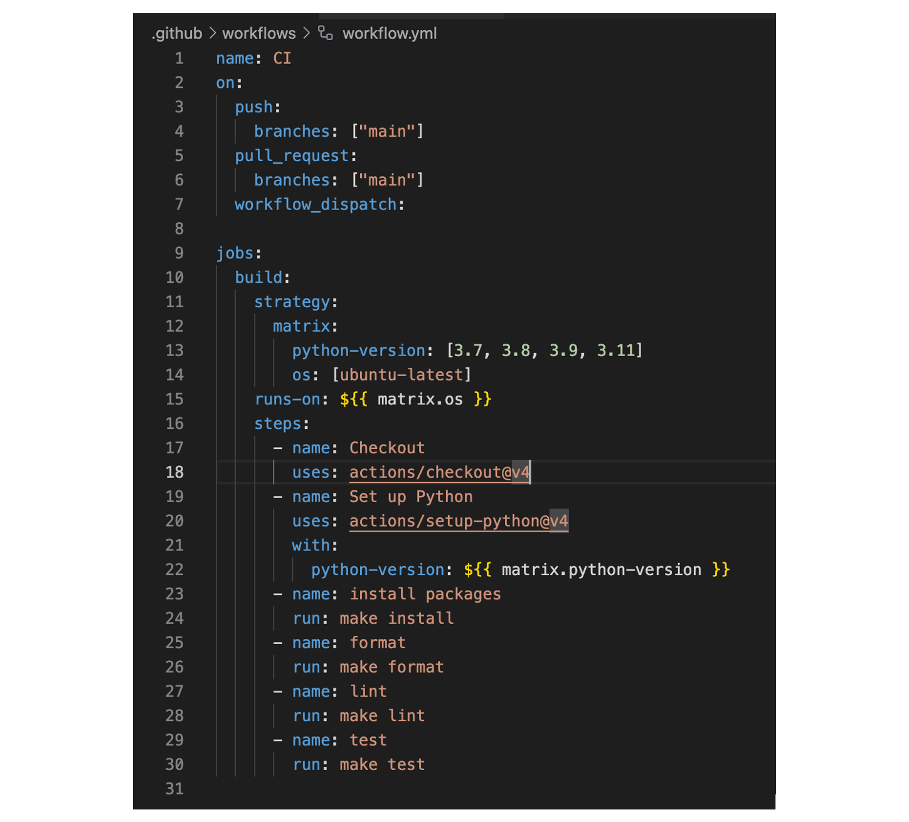

# Data Engineering Mini Project Four

[](https://github.com/nogibjj/Leonard_Eshun_Mini_Project_Four/actions/workflows/workflow.yml)


This repository is created as an assignment from the Data Engineering course, IDS 706. The aim is to create a python project template that contains functioning placeholders for key python project best-practice elements.

The requirements are:

1. Set up a Gitlab Actions workflow
1. Test across at least 3 different Python versions

## Steps taken to meet the requirements
1. The workflow.yml file in the .github/workflows folder was updated with the matrix for python versions 3.7, 3.8, 3.9, 3.11. 
1. The python code will be tested against these three version by CI to ensure it works with all of them. 
1. Please find an image of the workflow file below:



## This is what the python code does
It has two functions:

1. **get_the_capital_of_a_country** to get the capital city of a country
	```
	get_the_capital_of_a_country(country: str) -> str
	```
1. **add** to add two numbers
	```
	add(a, a)
	```


> [!TIP]
> Feel free to clone the repository.


## Other steps taken by CI
The code was pushed to Github and Github Actions did the following main things:

1. Setup the virtual environment according to the parameters in the workflow.yml
1. Packages were installed, including those in the requirements.txt file
1. All python files were formated by black
1. Code linting
1. Finally all the tests in the test_main.py were executed

